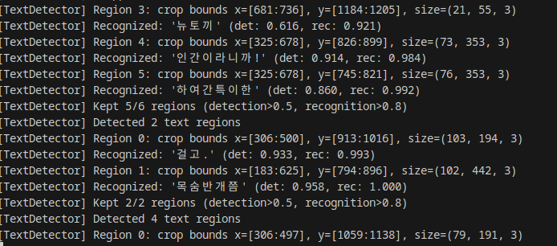
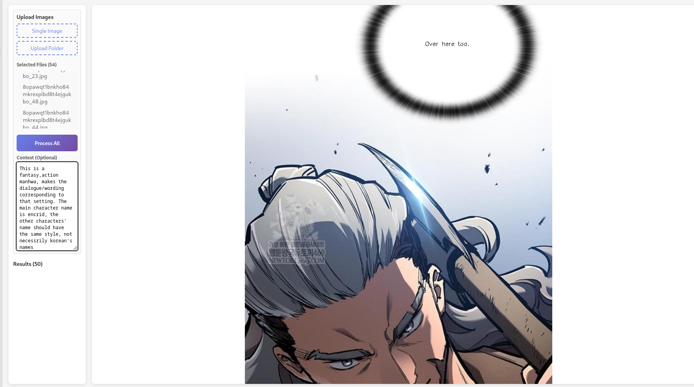

# READ README_WEB CORRESPONDING USAGE(theres a pyqt version if someone needs it)

## This repo uses paddleocr for text detection and text recognizing, i think the results are acceptable, the main task of translating lie on gemini anyway

# Some images for demo

### Before

### After(translated)

### Before

### After(translated)

### Simple ui
