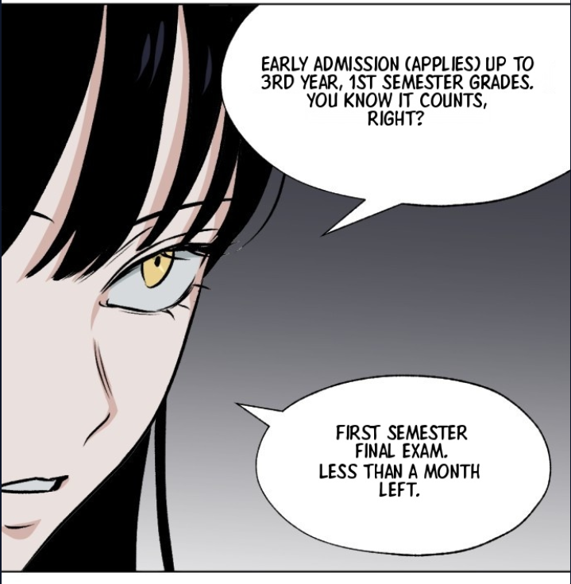
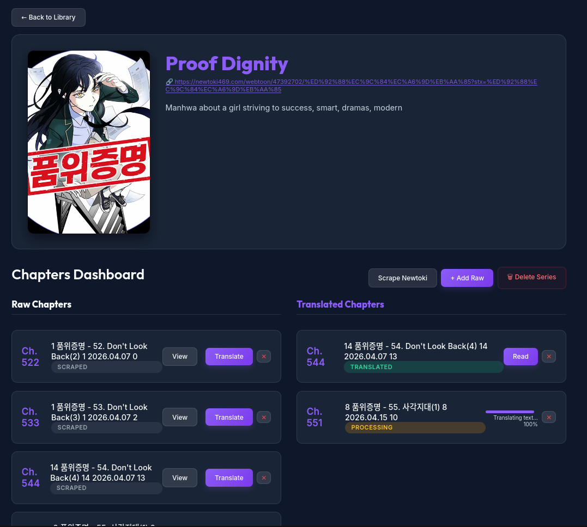
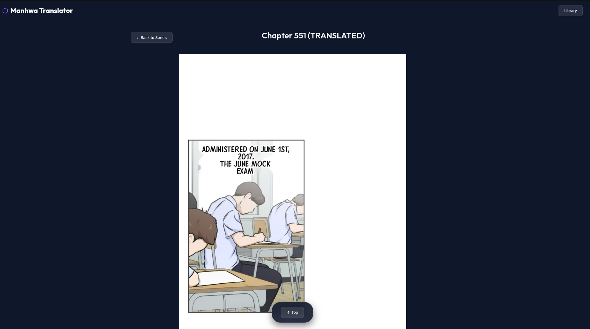

# Manhwa Machine Translator

A web-based tool to automatically scrape, detect, translate, read, manages Korean manhwa.(ONLY SUPPORT NEWTOKI SINCE I READ FROM THERE)

<p align="center">
  
  
</p>






## Features & Tech Stack
- **Dashboard**: library management for series.
- **Scraper**: Uses **DrissionPage**.(Chromedriver would get flagged)
- **OCR Engine**: Uses **PaddleOCR (Korean)** for text detection + recognition.
- **Translation**: Uses **Google Gemini AI** for high-quality, context-aware translations.(2.5 Flash)
- **Processing**: **Celery** with **Redis** handles OCR & Translation in the background.
- **Backend**: **FastAPI** with SQLite for a fast and reliable API.
- **Frontend**: JS + CSS

## How to Start

### 1. Requirements
Make sure you have **Redis** installed and
```
pip install -r requirements.txt
```

### 2. Configure API Key
Create a `.env` file in the root directory and add your Gemini API key:
```env
GEMINI_API_KEY=your_gemini_api_key_here
```

### 3. Run Backend
Note: Im currently putting use_gpu = True for all the OCRs. If you dont have a nvidia gpu, change it to False manually yourself.
The backend manages the API, database, and background workers.
```bash
bash start_backend.sh
```

### 4. Run Frontend
```bash
bash start_frontend.sh
```

Once both are running, open your browser and go to `http://localhost:3000`.
